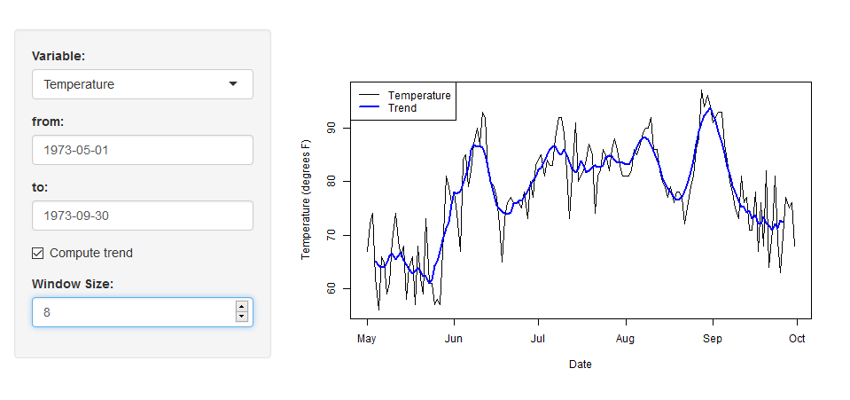

## Overview
This application allows user to visualize time series data very easily 
which contains some variables 
and offer some other functions such as trimming and computing trend.
When the data consists of several variables which were observed for a long period,
an analyst may want to:

* switch variables to visualize,   
* trim certain part of the graph and 
* roughly grasp trends. 

Needless to say, plotting graphs everytime when the user adds such operations is very inefficient
and this is where the application comes in. 
It can interactively switch which variables to show, 
display the data in greater detail by designating starting and eding dates
and show trend for the plotted data.

## About Data
As example of time series data which contained several variables,
the data set **airquality** is used, which is avaiable in R without 
installing any packages.
The data set is air quality mesured in New York City from May to Septempber in 1973.
The varibale includes:

* Ozone (ppb)
* Solar Radiation (lang)
* Wind (mph)
* Temperature (degrees F)

each of which is time series starting from May 1st to September 30th (1973).

## Details of Functions
**Variable**     : It switches varables.

**From / To**    : It sets starting and ending dates to visualize the data. 
Although any dates can be selected as long as they are from May 1st to September 30th, 
nothing is displayed or show error when From/To is reversed.

**Compute trend**: This check button turns on/off calcurating trend of the graph. 
The trend is defined as moving average, the method of computing average in a window 
(some neigboring data points) and sliding it over the period.
Concretely, trend is computed by following:

When N is odd:  $y_n = \frac{x_{n-\frac{N-1}{2}} +\cdots + x_n + \cdots + x_{n+\frac{N-1}{2} }}{N}$ 

When N is even: $y_n = \frac{x_{n-\frac{N}{2}-1} +\cdots + x_n + \cdots + x_{n+\frac{N}{2} }}{N}$

Where

$N$: Window Size

$x_n$: n th original point

$y_n$: n th point of trend

**Window Size**  : 
Window size governs smoothness of the trend, getting the trend smoother as the parameter increases,
and the parameter is selectable from 3 to 10.

