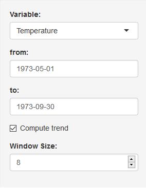

Application to Visuarize Time Series Data
========================================================
author: Masahito Tsukano
date: 9/25/2016

Background
========================================================
In visualizing time series data,
several operations should be done to original data such as:
- **Trimming**: cut certain period out of entire data
- **Selecting**: pick up variable to show
- **Computing trend**: compute trend to roughly understand how the data changes over the time.

However, it is inefficient to write plot command every time
when those operations are added...

Functions
========================================================
The application interactively visualize time series data as an user designates.

***
- **Select Variable**: select variable to show.
- **Designate from/to**:designate starting and ending dates to display
- **Compute trend**: apply moving average to plotted data
- **Set window size**: change window size of moving average.

About Data Set
========================================================
As an example of time series data, following data set is used in this application:
- **Data Set**: airquality
- **Description**: Daily air quality measurements in New York, May to September 1973.
- **Variables**: Ozone, Solar Radiation, Wind, Temperature

Example
========================================================
The graph shown below is displayed when:

- Variable = Temperature
- From/To = 5/1/1973 - 9/30
- Window Size = 8

